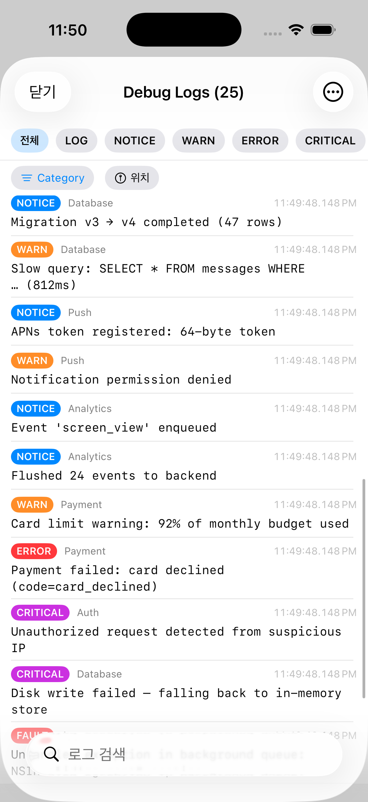

# LogViewer

<p align="center">
  🇺🇸 English | <a href="docs/README.ko.md">🇰🇷 한국어</a>
</p>

<p align="center">
  <a href="LICENSE"></a>
  
  
  
</p>

An in-app log viewer SwiftUI component for iOS apps.
Log capture, search, filter, share, and file export.

<p align="center">
  
</p>

## Table of Contents

- [Features](#features)
- [Requirements](#requirements)
- [Installation](#installation)
  - [Swift Package Manager (Xcode UI)](#swift-package-manager-xcode-ui)
  - [Package.swift](#packageswift)
- [Activation](#activation--read-this-first)
- [Logging](#logging)
- [Presenting the screen](#presenting-the-screen--your-choice)
  - [Pattern 1. NavigationLink in a debug menu](#pattern-1-navigationlink-in-a-debug-menu)
  - [Pattern 2. Presenting a sheet via a secret gesture](#pattern-2-presenting-a-sheet-via-a-secret-gesture-3-tap-long-press-etc)
  - [Pattern 3. A floating button only in debug builds](#pattern-3-a-floating-button-only-in-debug-builds)
  - [Pattern 4. Presenting from UIKit](#pattern-4-presenting-from-uikit)
  - [Pattern 5. Presenting on shake (UIWindow subclass)](#pattern-5-presenting-on-shake-uiwindow-subclass)
- [Configuration](#configuration)
- [Log export](#log-export)
- [Data model](#data-model)
- [Examples](#examples)
- [License](#license)

## Features

- Log capture (`LogStore`) — level/category/location metadata, ring-buffer (default 500 entries)
- Log screen (`LogViewerView`) — search/highlight, level/category filters, text sharing, `.log` file export
- Lightweight design — the library does not enforce "how to present it"; it provides only the screen component. The app is free to decide how to present it.
- iOS 16+ / SwiftUI / Swift 6.0 toolchain

## Requirements

- iOS 16.0+
- Xcode 15+ (Swift 5.9 or later; Swift 6 toolchain compatible)

## Installation

### Swift Package Manager (Xcode UI)

File → Add Package Dependencies → URL → `https://github.com/ljdongz/LogViewer`

### Package.swift

```swift
// swift-tools-version: 5.9
import PackageDescription

let package = Package(
    name: "MyApp",
    platforms: [.iOS(.v16)],
    dependencies: [
        .package(url: "https://github.com/ljdongz/LogViewer", from: "1.0.0"),
    ],
    targets: [
        .target(
            name: "App",
            dependencies: [
                .product(name: "LogViewer", package: "LogViewer"),
            ]
        ),
    ]
)
```

## Activation — Read this first

LogViewer defaults to disabled, and **the consuming app must explicitly turn it on** for logs to be captured. This is because SPM libraries are built in release mode, so the library's internal `#if DEBUG` cannot detect the consuming app's build configuration. Call `LogViewer.setup { ... }` inside `#if DEBUG` at your app's entry point.

```swift
import SwiftUI
import LogViewer

@main
struct MyApp: App {
    init() {
        #if DEBUG
        LogViewer.setup {
            $0.maxLogCount = 1000
            $0.dateFormat = "HH:mm:ss.SSS"
        }
        #endif
    }

    var body: some Scene {
        WindowGroup { ContentView() }
    }
}
```

`setup(_:)` activates the library and applies optional configuration in a single call. The closure is optional — call `LogViewer.setup()` to enable with defaults. When the library is disabled (the default state in release builds), all public APIs (`LogStore.shared.log(...)`, `LogViewerView`, etc.) become no-ops with negligible runtime cost.

`LogViewer.isEnabled` is exposed as a read-only flag — its setter is `internal`, so you cannot toggle it directly. Activation is intentionally one-way; runtime toggling is not a supported scenario.

## Logging

```swift
LogStore.shared.log(level: .notice,  category: "App",     message: "App started")
LogStore.shared.log(level: .warning, category: "Network", message: "429 Too Many Requests")
LogStore.shared.log(level: .error,   category: "Payment", message: "Card limit exceeded")
```

`LogStore.shared.log(...)` is `nonisolated`, so it can be called from any thread (it hops to MainActor internally). No `await` is required at the call site.

`LogEntry.Level` cases: `.log`, `.notice`, `.warning`, `.error`, `.critical`, `.fault` (Comparable).

## Presenting the screen — your choice

This library provides only `LogViewerView()`. When and how to present it is up to the app. A collection of common patterns is summarized below.

### Pattern 1. NavigationLink in a debug menu

```swift
import SwiftUI
import LogViewer

struct DebugMenu: View {
    var body: some View {
        NavigationStack {
            List {
                NavigationLink("View Logs") { LogViewerView() }
            }
            .navigationTitle("Debug")
        }
    }
}
```

### Pattern 2. Presenting a sheet via a secret gesture (3-tap, long press, etc.)

```swift
import SwiftUI
import LogViewer

struct ContentView: View {
    @State private var showLog = false

    var body: some View {
        MyRootView()
            .onTapGesture(count: 3) { showLog = true }
            .sheet(isPresented: $showLog) { LogViewerView() }
    }
}
```

### Pattern 3. A floating button only in debug builds

```swift
import SwiftUI
import LogViewer

struct RootView: View {
    @State private var showLog = false

    var body: some View {
        ZStack {
            MyRootView()
            #if DEBUG
            VStack {
                Spacer()
                HStack {
                    Spacer()
                    Button {
                        showLog = true
                    } label: {
                        Image(systemName: "doc.text.magnifyingglass")
                            .padding()
                            .background(.thinMaterial, in: .circle)
                    }
                    .padding()
                }
            }
            #endif
        }
        .sheet(isPresented: $showLog) { LogViewerView() }
    }
}
```

### Pattern 4. Presenting from UIKit

```swift
import UIKit
import SwiftUI
import LogViewer

final class DebugViewController: UIViewController {
    @IBAction func openLogViewer(_ sender: Any) {
        let vc = UIHostingController(rootView: LogViewerView())
        present(vc, animated: true)
    }
}
```

### Pattern 5. Presenting on shake (UIWindow subclass)

If you want it, add the following 5-line subclass to your app code. The library does not enforce this behavior.

```swift
import UIKit

final class ShakeWindow: UIWindow {
    var onShake: (() -> Void)?

    override func motionBegan(_ motion: UIEvent.EventSubtype, with event: UIEvent?) {
        super.motionBegan(motion, with: event)
        if motion == .motionShake { onShake?() }
    }
}
```

In `SceneDelegate`, create it with `ShakeWindow(windowScene: ws)`, and in `onShake` wrap `LogViewerView()` in a `UIHostingController` and present it. For apps using SwiftUI `WindowGroup`, either inject a SceneDelegate via `UIApplicationDelegateAdaptor`, or use the gesture triggers from patterns 2/3.

## Configuration

`LogViewerConfiguration`:

| Option | Type | Default | Description |
| ---- | ---- | ------ | ---- |
| `maxLogCount` | `Int` | `500` | Maximum ring-buffer capacity. When exceeded, the oldest entries are discarded first. |
| `dateFormat` | `String` | `"HH:mm:ss.SSS"` | Timestamp display format. |

Pass the configuration closure to `LogViewer.setup(_:)`:

```swift
LogViewer.setup { config in
    config.maxLogCount = 5_000
    config.dateFormat  = "yyyy-MM-dd HH:mm:ss.SSS"
}
```

`setup(_:)` activates the library and applies the configuration atomically. Calling it multiple times is supported — later calls update the configuration but activation only happens once.

## Log export

```swift
let text = LogStore.shared.exportAsText(includeLocation: true)
let url  = LogStore.shared.exportAsLogFile()  // creates a .log file in the tmp directory
```

The share button inside `LogViewerView` uses the same export. In UIKit, passing `text` or `url` to a `UIActivityViewController` opens the system share sheet.

## Data model

- `LogEntry`
  - `id: UUID`
  - `timestamp: Date`
  - `level: LogEntry.Level`
  - `category: String`
  - `message: String`
  - `file: String`, `function: String`, `line: Int`
- `LogEntry.Level`: `.log`, `.notice`, `.warning`, `.error`, `.critical`, `.fault` (Comparable)
- `LogStore`
  - `static let shared`
  - `@Published var entries: [LogEntry]`
  - `var availableCategories: [String]`
  - `nonisolated func log(level:category:message:file:function:line:)`
  - `func clear()`
  - `func exportAsText(includeLocation:) -> String`
  - `func exportAsLogFile(includeLocation:) -> URL`

## Examples

- `Examples/SwiftUIExample` — triggering directly from SwiftUI (sheet/NavigationLink patterns)
- `Examples/UIKitExample` — pattern for presenting via `UIHostingController` from UIKit

You can open each directory's `.xcodeproj` in Xcode and run it directly.

## License

MIT License. See the [LICENSE](./LICENSE) file for details.
